ONG MÃOS AMIGAS — Atividade 2
🎯 Objetivo

Aplicar CSS3 para estilizar e padronizar as páginas do site da ONG MÃOS AMIGAS, com foco em design system, responsividade e acessibilidade.

🎨 Recursos Utilizados

HTML5 — estrutura semântica

CSS3 — tipografia, cores, espaçamento e responsividade

Google Fonts: Cabin

Paleta de Cores
Uso	Cor	Hex
Primária	Azul	#0077b6
Secundária	Azul escuro	#005f8d
Destaque	Azul claro	#5CB3FF
Fundo	Cinza claro	#f4f4f4
Texto	Cinza escuro	#333333
Branco	Base neutra	#ffffff
♿ Acessibilidade

Contraste mínimo ≥ 4.5 : 1

Navegação simples e intuitiva

Links e botões com foco visível (:focus-visible)

Estrutura semântica correta (header, main, footer)

Uso de aria-current="page" para indicar a página ativa

✅ Validação W3C

imagens/docs/
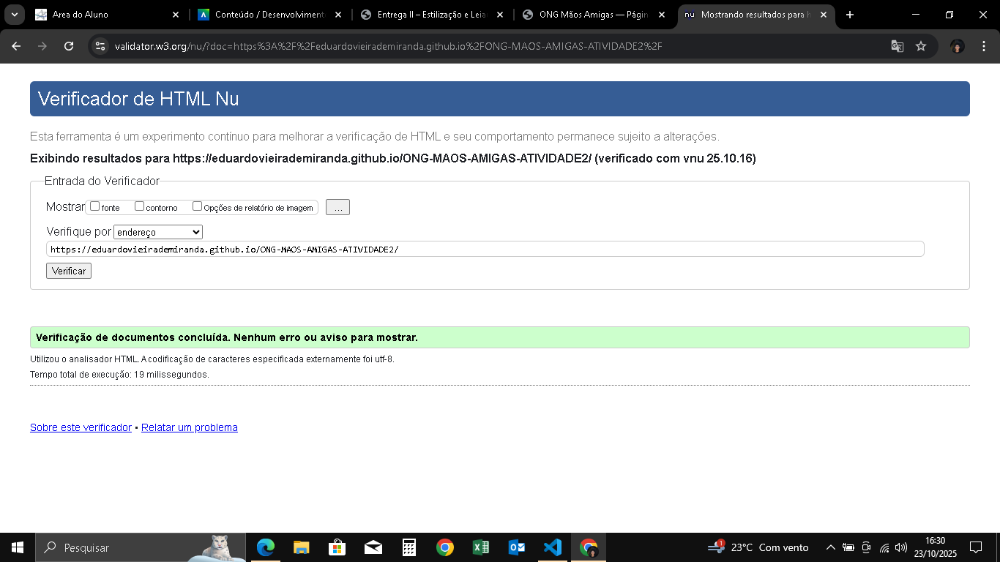
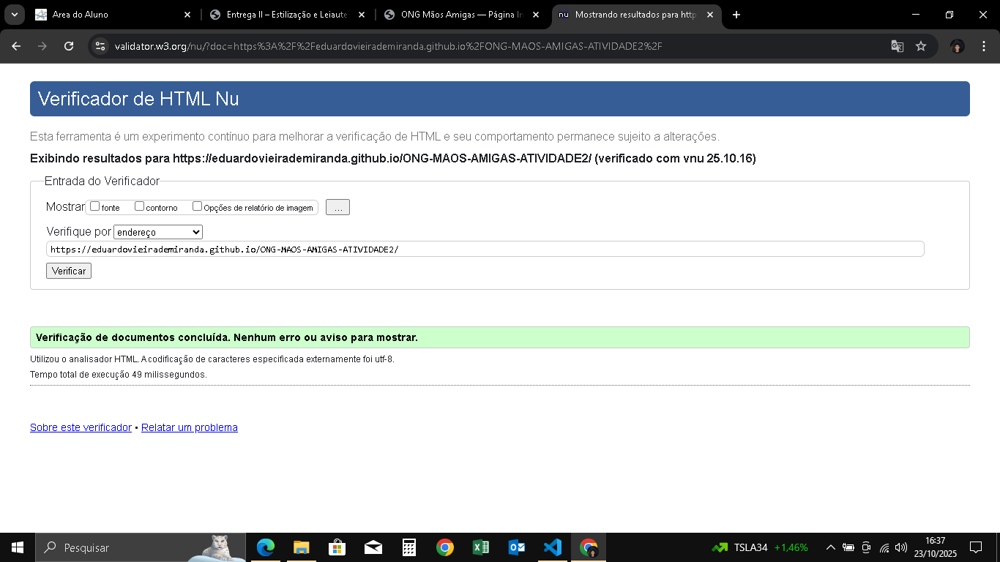

Nenhum erro encontrado.

O CSS foi revisado e testado em diferentes resoluções.

## ✅ Validação W3C

**Comprovantes:**  
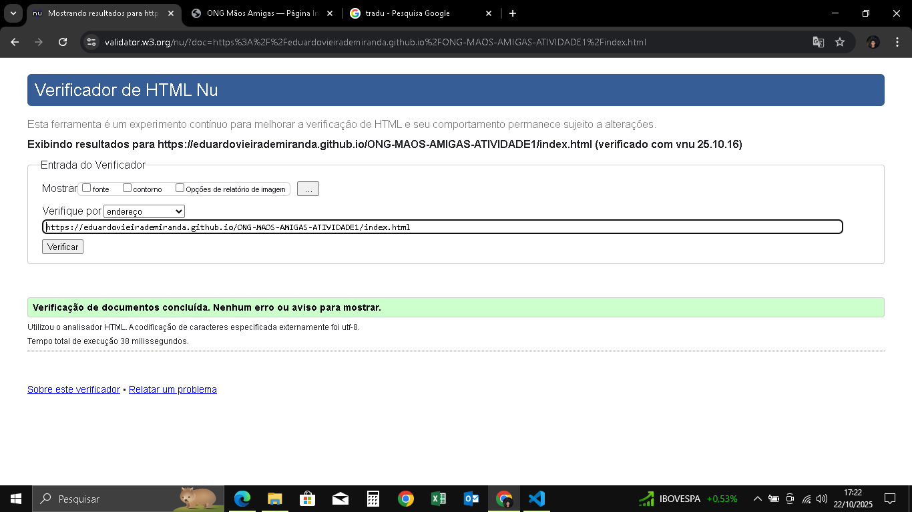  
  
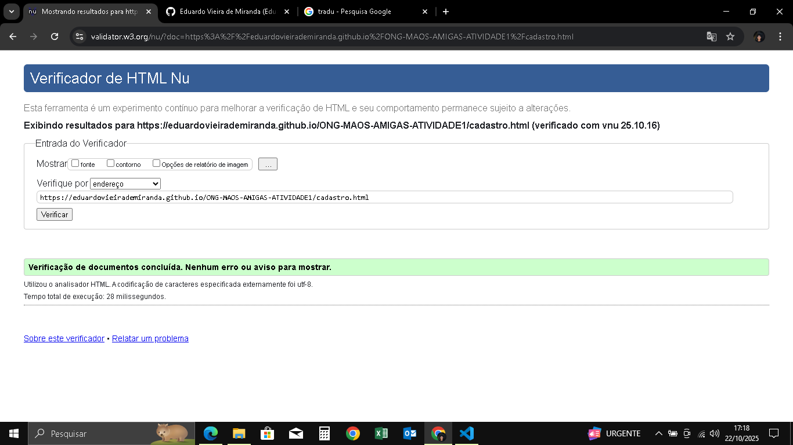

|
## 📸 Visual das Páginas

### Início
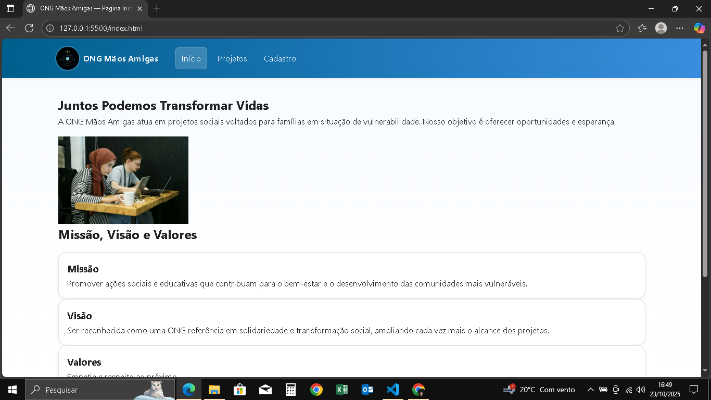
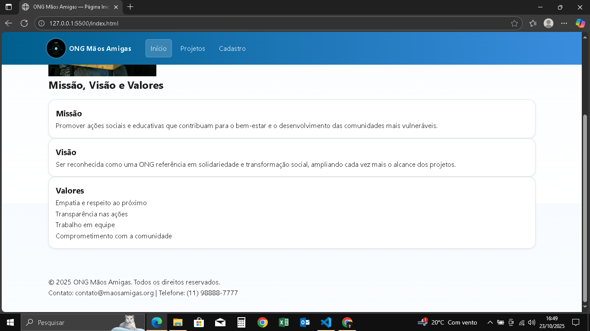

### Projetos
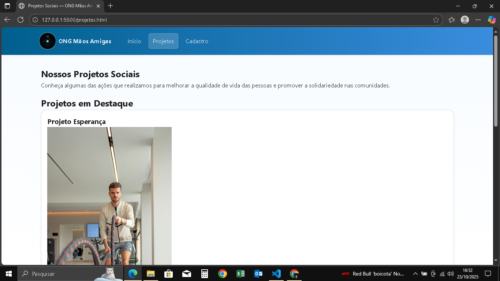
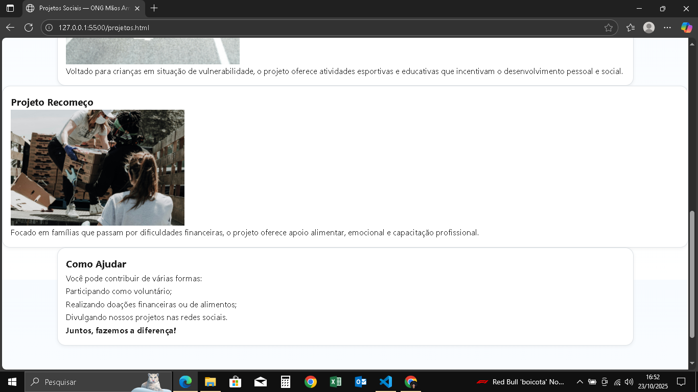

### Cadastro
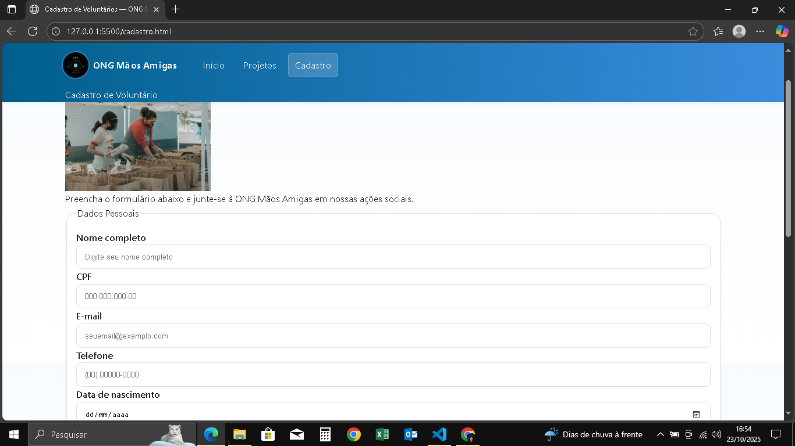
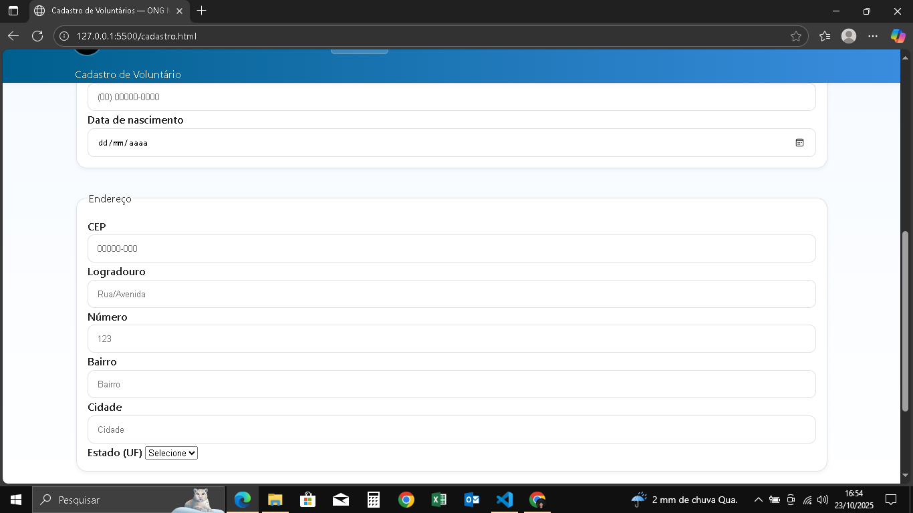
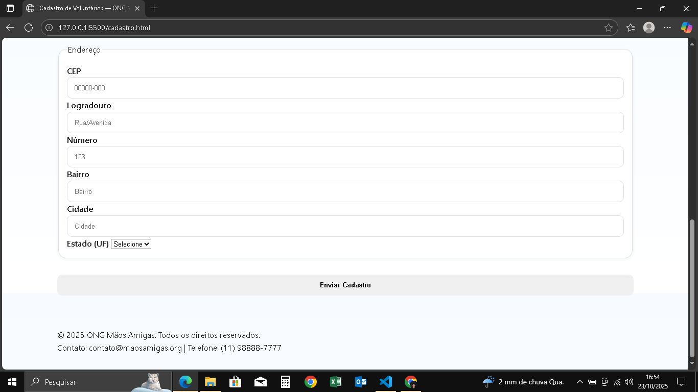

CSS ## ✅ Validação W3C
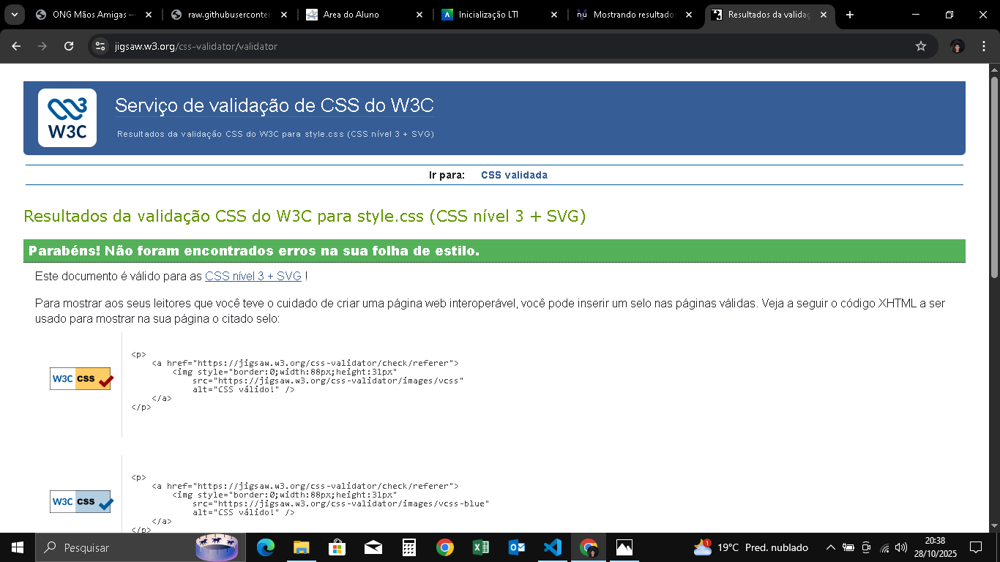

⚙️ Execução

Abra qualquer arquivo .html com o Live Server do VS Code ou diretamente no navegador.
As páginas são totalmente estáticas e usam apenas HTML + CSS.

🧠 Resumo

A Atividade 2 consolidou o uso de CSS3, com foco em:

Aplicação do Design System;

Estruturação visual e componentes reutilizáveis;

Responsividade em 3 breakpoints (992 px, 768 px e 420 px);

Acessibilidade com foco e contraste adequados;

Validação W3C 100 % sem erros.