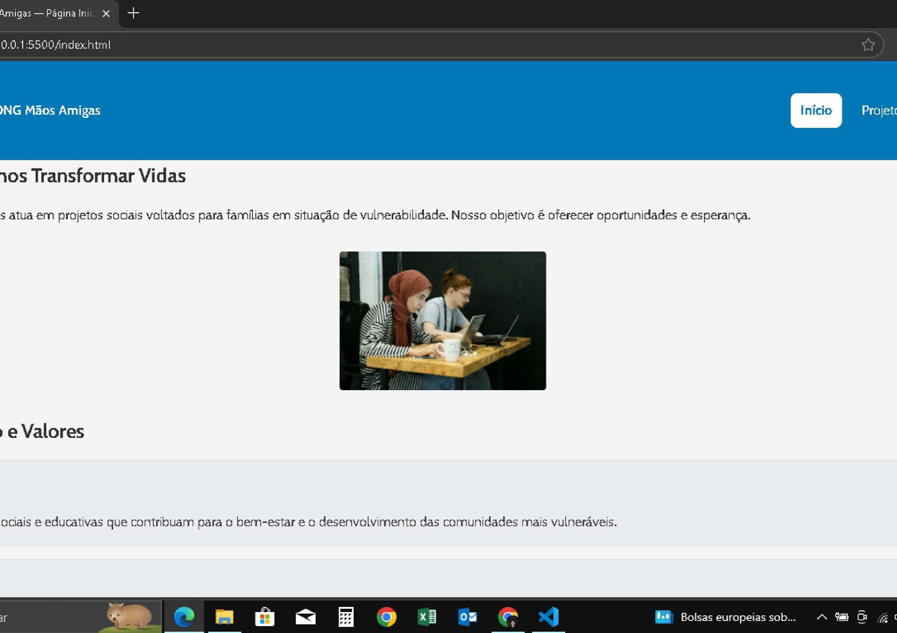
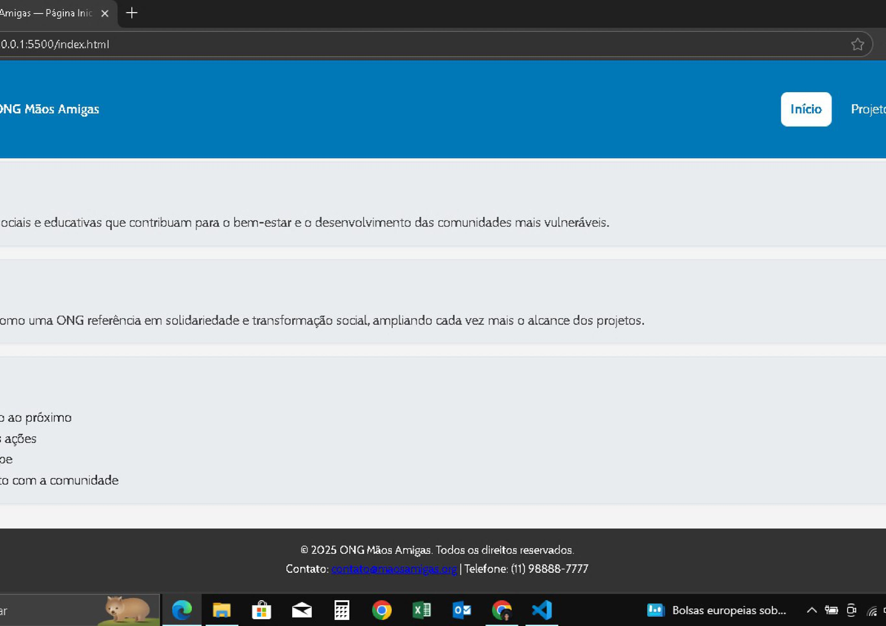
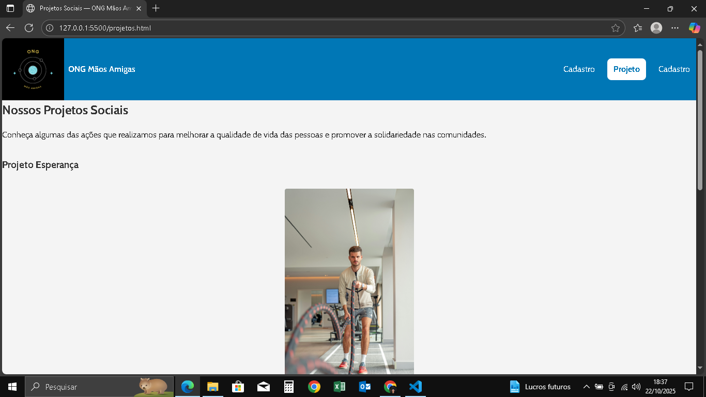
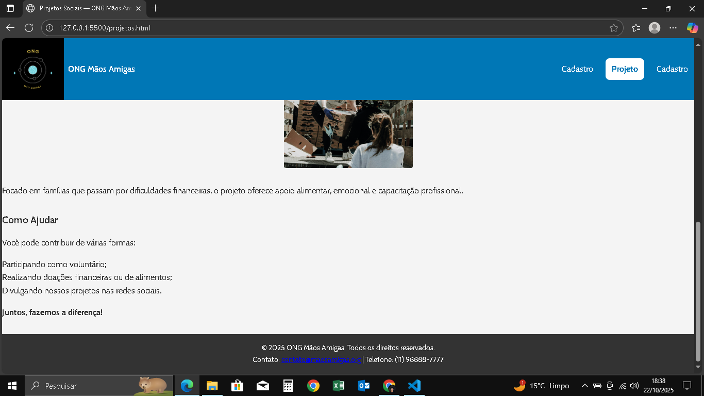
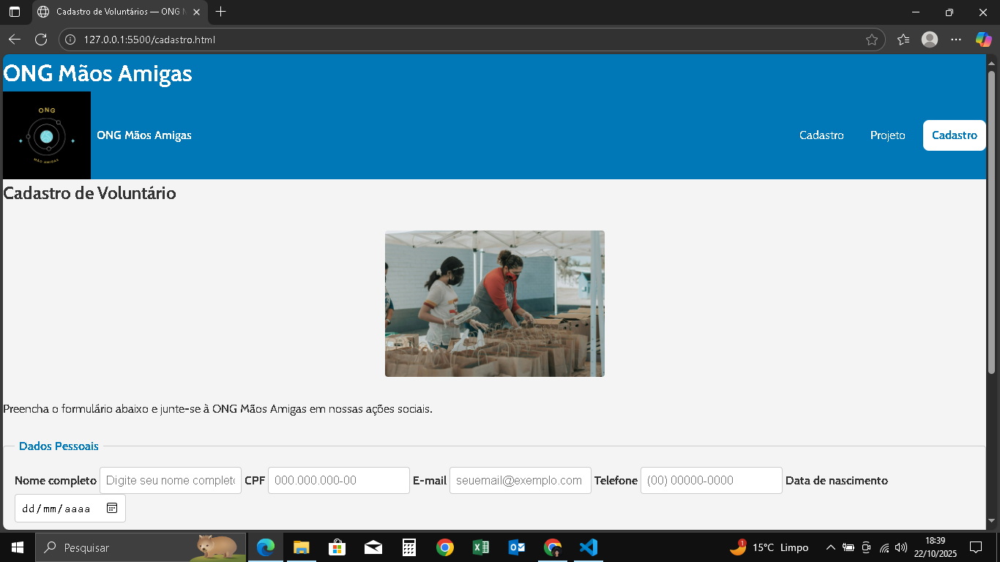
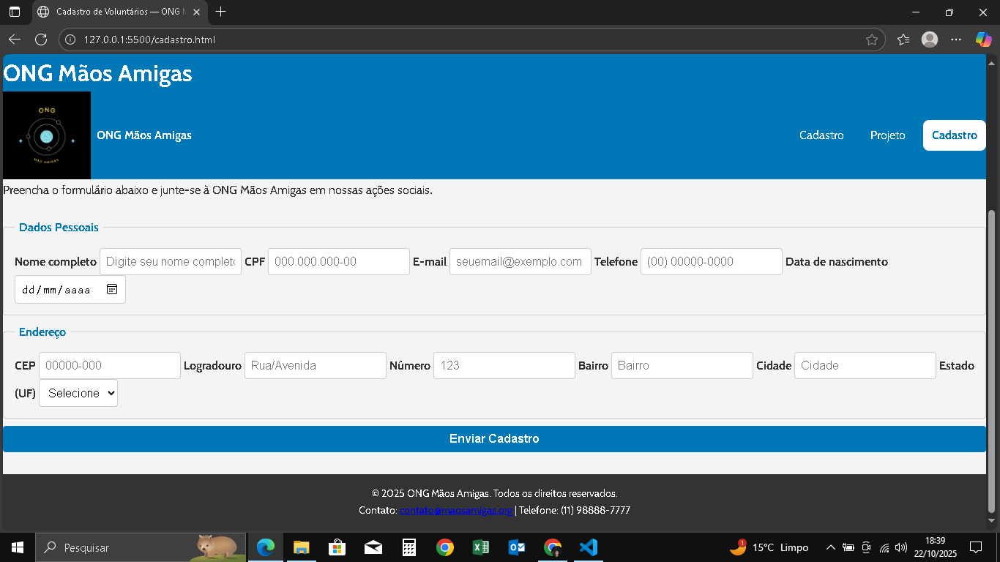

---

## 🎨 Recursos Utilizados
- **HTML5** — estrutura semântica  
- **CSS3** — tipografia, cores, espaçamento e responsividade  
- **Google Fonts:** *Cabin*  

### Paleta de Cores
| Uso | Cor | Hex |
|-----|-----|-----|
| Primária | Azul | `#0077b6` |
| Secundária | Azul claro | `#5CB3FF` |
| Fundo | Cinza claro | `#f4f4f4` |
| Texto | Cinza escuro | `#333333` |

---

## ♿ Acessibilidade
- Contraste mínimo ≥ 4.5:1  
- Navegação simples e intuitiva  
- Links com foco visível (`:focus-visible`)  
- Textos justificados e legíveis  

---

## ✅ Validação W3C
- Todos os arquivos HTML foram validados no [W3C Validator](https://validator.w3.org/).  
- Nenhum erro encontrado.  
- O CSS não exige validação formal, mas foi revisado e testado em diferentes resoluções.

---

## 📸 Visual das Páginas

| Página | Visual |
|---------|---------|
 **Início** | 
 **Início** | 

| **Projetos** |  |
| **Projetos** |  |

| **Cadastro** |  |
**Cadastro** |  |

---

## ⚙️ Execução
Abra qualquer arquivo `.html` com o **Live Server** do VS Code ou diretamente no navegador.

---

## 🧠 Resumo
A Atividade 2 consolidou o uso de **CSS3**, com foco em:  
- Aplicação do design system;  
- Estruturação de componentes;  
- Responsividade;  
- Acessibilidade básica.

---
